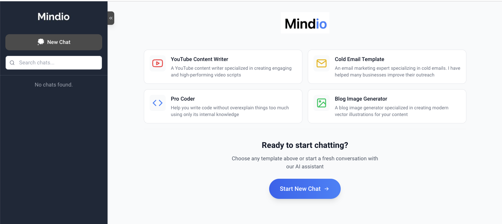

# 🚀 Mindio - Where AI Meets Imagination

> Transform your ideas into reality with the power of AI at [mindio.chat](http://mindio.chat)

&nbsp;
&nbsp;
<div align="center">
  
</div>


Unleash the full potential of AI with Mindio - your all-in-one creative companion that brings together chat, image generation, and document analysis in one seamless experience. Whether you're a creator, developer, or professional, Mindio empowers you to achieve more with less effort.

### ✨ Why Choose Mindio?
- 🎯 **Smart Conversations** - Context-aware AI that understands your needs
- 🎨 **DALL-E Powered Images** - Create stunning visuals with simple prompts
- 📊 **Intelligent Analysis** - Process documents and code with AI precision
- ⚡ **Lightning Fast** - Get instant responses powered by GPT-4 technology

[Try Mindio Now →](http://mindio.chat)

## ✨ Features

- 🤖 **Advanced AI Chat** - Engage in natural conversations with state-of-the-art language models
- 🎨 **Image Generation** - Create stunning visuals using DALL-E integration
- 📄 **Document Analysis** - Process and analyze PDFs, text files, and code files
- 💻 **Code Assistant** - Get help with coding, debugging, and technical documentation
- 🎯 **Customizable Experience** - Adjust tone, writing style, and output format to your needs

<div align="center">
  
</div>

## �� Getting Started

1. Clone the repository
2. Install dependencies:
```bash
npm install
```
3. Start the development server:
```bash
npm run dev
```
4. Open [http://localhost:3010](http://localhost:3010) in your browser

## 🔑 API Configuration

Mindio requires an OpenAI API key to function. You can add your API key through the application's settings panel.

## 💡 Use Cases

- **Content Creation** - Generate blog posts, social media content, and marketing copy
- **Technical Writing** - Create documentation, code explanations, and technical guides
- **Visual Design** - Generate custom images for your projects
- **Document Processing** - Analyze and extract insights from various document formats
- **Code Development** - Get assistance with coding tasks and debugging

## 🛠 Tech Stack

- Next.js 15.0
- React 19
- OpenAI API Integration
- TailwindCSS
- SASS/SCSS
- PDF Processing
- Prism.js for code highlighting

## 🎨 Features in Detail

### AI Chat
- Multiple conversation styles
- Context-aware responses
- Code syntax highlighting
- Markdown support

### Image Generation
- DALL-E integration
- Multiple image sizes
- Image editing capabilities
- Context-aware image generation

### Document Analysis
- PDF processing
- Code file analysis
- Text file processing
- Smart content extraction

## 📱 Responsive Design

Mindio is fully responsive and works seamlessly across desktop, tablet, and mobile devices.

## 🔒 Privacy & Security

- Client-side API key storage
- No data persistence without user consent
- Secure file processing

## 🌐 Learn More

Visit [http://mindio.chat](http://mindio.chat) to explore Mindio's capabilities.

## 📄 License

MIT License - feel free to use this project for your own purposes.

---

Built with ❤️ using Next.js and OpenAI
